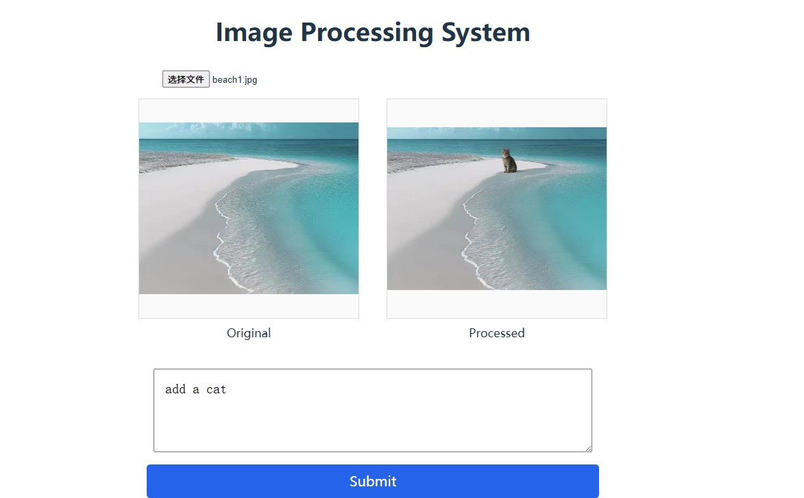

# Image Processing through AIGC

[](LICENSE)



## Project Overview

**Image Processing through AIGC** is an AI-powered web application for intelligent image creation and editing. Users can upload images and enter prompts; the backend leverages Replicate’s cutting-edge AI models to generate new images or artistic results based on user instructions. This project features a modern web stack with a user-friendly frontend and secure Node.js/Express backend, making it easy to experience the creative power of AIGC (AI Generated Content).

## Features

- 💡 Upload an image and generate intelligent outputs with custom prompts
- 🧠 Integrates with AI image generation models on Replicate
- 🎨 Clean, easy-to-use frontend interface
- ⚡ Secure, efficient RESTful backend based on Node.js/Express
- 🌐 Clear project structure for extensibility


## Tech Stack

- **Backend:** Node.js, Express, Replicate API
- **Frontend:** Modern JavaScript (see the `frontend` directory)
- **License:** MIT

## Directory Structure

```
Image_Processing_through_AIGC/
├── backend/       # Backend service (Node.js/Express/AI API integration)
├── frontend/      # Frontend code (UI, business logic etc.)
├── .gitignore
├── LICENSE
└── README.md
```

## Getting Started

1. Clone this repository:
   ```bash
   git clone https://github.com/dl956/Image_Processing_through_AIGC.git
   ```

2. Install dependencies and run services (enter both backend and frontend directories as needed):

   Backend example:
   ```bash
   cd backend
   npm install
   npm start
   ```

   Frontend example:
   ```bash
   cd ../frontend/my-vite-app
   npm install
   npm run dev
   ```

Set the Replicate API token in your shell before starting the backend.

**Unix/Linux/macOS:**
```bash
export REPLICATE_API_TOKEN=your_token_here
```

**Windows PowerShell:**
```powershell
$env:REPLICATE_API_TOKEN="your_token_here"
```

3. Open your browser and visit the frontend address. Follow the instructions to upload images and enter prompts to experience creative AI-powered image processing!

## License

This project is licensed under the [MIT License](LICENSE).

---

> For questions or contributions, feel free to submit an issue or pull request!
